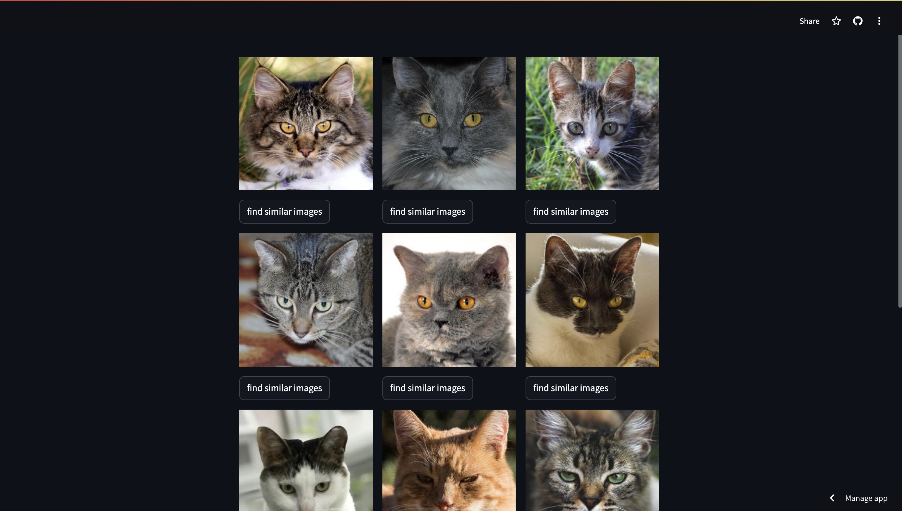

# Image Similarity Search Application



## About the Project

### Inspiration

The inspiration for this project came from the need to efficiently manage and search through large collections of images. With the growing volume of digital content, finding similar images manually becomes increasingly challenging. Leveraging AI to automate this process can save time and enhance productivity for various applications, such as digital asset management, content creation, and research.

### What We Learned

Building this project provided valuable insights into several key areas:
- **AI and Machine Learning:** Gained deeper understanding of how image embeddings work and how to utilize pre-trained models like "microsoft/resnet-50" for generating these embeddings.
- **Streamlit for Web Applications:** Learned to create interactive and user-friendly web applications using Streamlit.
- **Qdrant Vector Database:** Acquired knowledge about storing and querying high-dimensional vectors efficiently.
- **Data Processing:** Developed skills in handling and processing image data, including resizing, encoding, and decoding.

### How We Built the Project

1. **Setting Up the Environment:**
   - Cloned the repository and installed the required packages.
   - Set up Qdrant for storing image embeddings.

    ```bash
    git clone https://github.com/surbhi498/ImageSearchEngine.git
    cd streamlit
    pip install -r requirements.txt
    ```

2. **Generating Image Embeddings:**
   - Utilized "microsoft/resnet-50" model from Transformers and PyTorch to generate embeddings for images.

3. **Building the Streamlit Application:**
   - Created a Streamlit app to fetch initial records from a Qdrant collection and display images.
   - Added functionality for users to select a record and find similar images based on embeddings.
   - Implemented caching of the QdrantClient instance for efficiency.

4. **Image Processing:**
   - Used PIL to dynamically resize and preprocess images.
   - Converted images to base64 format for rendering in Streamlit.

### Challenges Faced

- **Embedding Generation:** Understanding and implementing image embeddings using a pre-trained model required significant research and experimentation.
- **Efficiency:** Ensuring that the application performs efficiently with large datasets was a major challenge, particularly in terms of querying and displaying images.
- **Data Handling:** Handling and processing images, including encoding and decoding base64 strings, presented various technical challenges.

### Future Enhancements

- **Scalability:** Improve the scalability of the application to handle larger datasets more efficiently.
- **Additional Features:** Add more functionalities such as filtering results based on different criteria and integrating more advanced image processing techniques.
- **User Interface:** Enhance the user interface to provide a more seamless and intuitive experience.

### Visit Our Deployed Application

You can visit our website [here](https://bby4nz8tfecnwbffyy7wnn.streamlit.app/).

### Tutorial Video

Watch the tutorial video for a demonstration of this project on [YouTube](https://youtu.be/BPx_9ChUHL8).

---

Feel free to explore and provide feedback!
